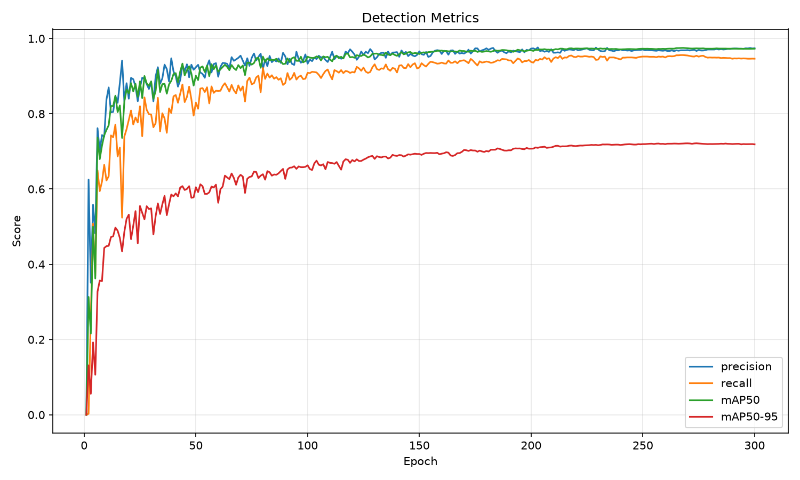
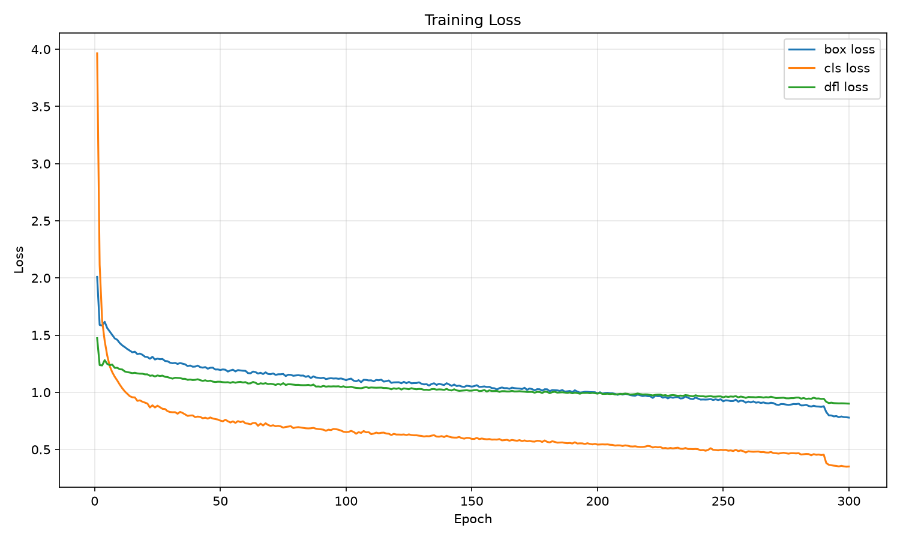
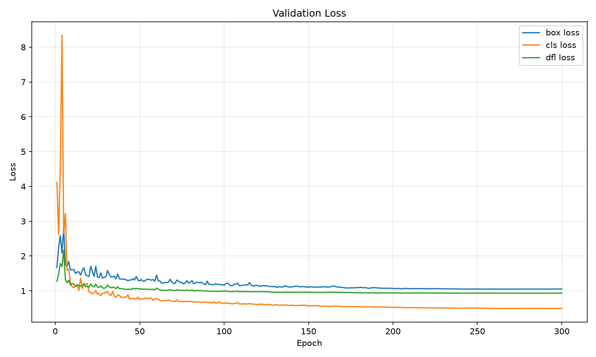
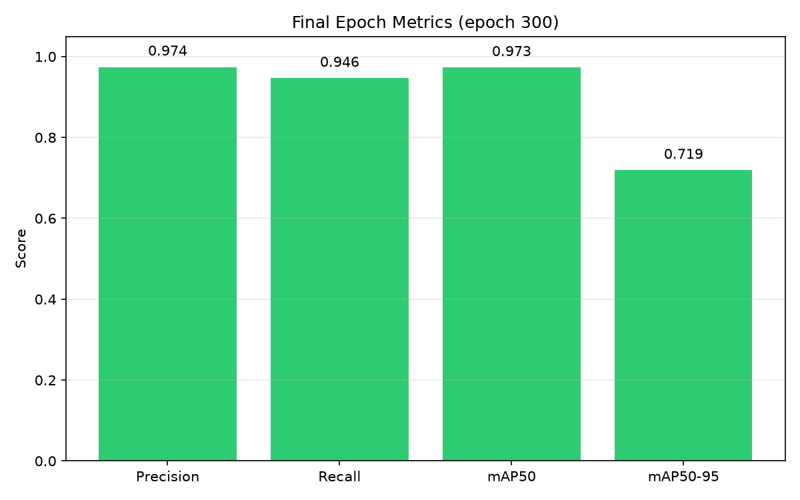

# Model Reference

Model weights (`models/N_new720p.pt`, `models/S_new720p.pt`) and training logs (`models/results.csv`, `models/results.png`) are tracked in this repository. For dataset access or updated weights, contact **[berkeduruu@gmail.com](mailto:berkeduruu@gmail.com)**.

All YOLOv11 variants in this project share the same training pipeline ([`codes/train/YoloPlane.ipynb`](../codes/train/YoloPlane.ipynb)): `IMAGE_SIZE=640`, train/val split, and custom augmentation. [`results.csv`](results.csv) is the **shared reference training log** for project models — it is not tied to a single variant name in this file.

See the main [README](../README.md#jetson-deployment) for deployment notes.

## Reference Training Results

Final epoch summary from [`results.csv`](results.csv) (epoch 300):

| Metric | Value |
|--------|-------|
| Precision | 0.974 |
| Recall | 0.946 |
| mAP50 | 0.973 |
| mAP50-95 | 0.719 |

### Training Curves

The Ultralytics-generated [`results.png`](results.png) shows all training curves in one image. The per-metric charts below were generated with [`plot_training_results.py`](plot_training_results.py).









To regenerate charts after updating `results.csv`:

```bash
python models/plot_training_results.py
```

## Inference Recommendations

| Use case | Setting | Source |
|----------|---------|--------|
| GPU inference (FP16) | `half=True` in `model.predict()` — recommended on NVIDIA CUDA and AMD ROCm for higher throughput | Ultralytics API |
| Video detection | `imgsz=[1280, 736]` | [`video_detection.py`](../codes/inference/video_detection.py) |
| TensorRT export | `imgsz=[720]`; use `half=True` when exporting the engine | [`export_tensorrt_engine.py`](../codes/export/export_tensorrt_engine.py) |
| Ensemble ROI | `DETECT_CONF=0.10`, `MIN_INDIVIDUAL_CONF=0.25`, `MIN_AVERAGE_CONF=0.45` | [`video_dynamic_roi_ensemble_detection.py`](../codes/inference/video_dynamic_roi_ensemble_detection.py) |

Example:

```python
results = model.predict(source, imgsz=[1280, 736], half=True, verbose=False)
```

## `results.csv` Columns

| Column | Description |
|--------|-------------|
| `epoch` | Training epoch |
| `time` | Cumulative training time (seconds) |
| `train/box_loss`, `train/cls_loss`, `train/dfl_loss` | Training losses |
| `metrics/precision(B)`, `metrics/recall(B)` | Box precision and recall |
| `metrics/mAP50(B)`, `metrics/mAP50-95(B)` | mAP at IoU 0.50 and 0.50–0.95 |
| `val/box_loss`, `val/cls_loss`, `val/dfl_loss` | Validation losses |
| `lr/pg0`, `lr/pg1`, `lr/pg2` | Learning rate schedule |
